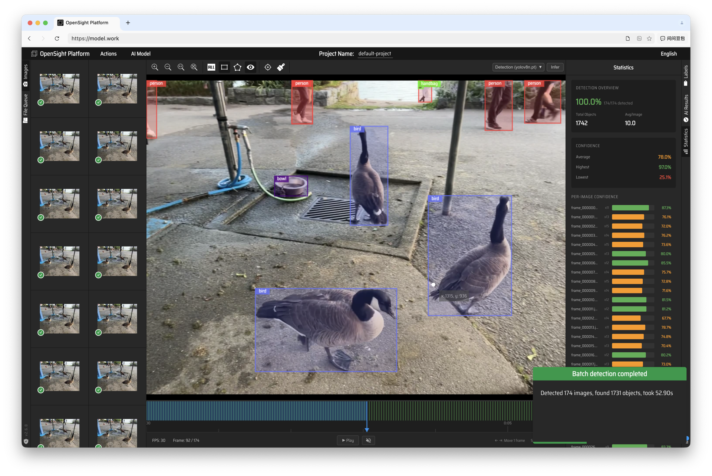

# OpenSight Platform

AI-powered visual annotation tool with object detection, instance segmentation, and video tracking.

Built on [make-sense](https://github.com/SkalskiP/make-sense) by Skalski.



**Live Demo**: [https://model.work](https://model.work/)

## Features

- **Object Detection** — YOLO family (v8/v9/v10/11/12/26), custom .pt/.onnx models
- **Instance Segmentation** — SAM / SAM 2 / SAM 3, MobileSAM, FastSAM, YOLO-seg
- **Video Mode** — frame extraction, timeline navigation, frame-level annotation
- **Video Tracking** — SAM 2 propagation across frames
- **Smart Annotation** — click-to-segment with SAM prompt mode
- **Batch Inference** — multi-image detection in one pass
- **Custom Scripts** — upload Python pre/post-process hooks for the inference pipeline
- **Export** — YOLO, COCO, VOC, CSV, VGG formats
- **Import** — COCO, YOLO, VOC annotations

## Quick Start

```bash
# Frontend
npm install
npm start          # http://localhost:3001

# Backend (required for AI inference)
cd backend
pip install -r requirements.txt
uvicorn app.main:app --host 0.0.0.0 --port 8000
```

## Project Structure

```
src/
  ai/                 # AI detector/segmentation integrations
  views/              # UI components (Editor, Popups, Timeline)
  store/              # Redux state management
  logic/              # Business logic, actions, hotkeys
backend/              # FastAPI inference server (separate repo)
  app/
    api/routes.py     # /detect, /segment, /batch_detect, /health
    services/         # detection.py, segmentation.py, tracking.py
    scripts/          # User-uploaded pre/post-process hooks
```

## Tech Stack

- **Frontend**: React 18 + TypeScript + Redux + Vite + Canvas API
- **Backend**: FastAPI + Ultralytics + PyTorch
- **Segmentation**: SAM 2 / SAM 3 via Ultralytics

## Requirements

- Node.js 18+
- Python 3.10+
- PyTorch (CUDA or MPS for GPU acceleration)

## License

This project is licensed under [GPL-3.0](LICENSE), following the upstream [make-sense](https://github.com/SkalskiP/make-sense) license.
