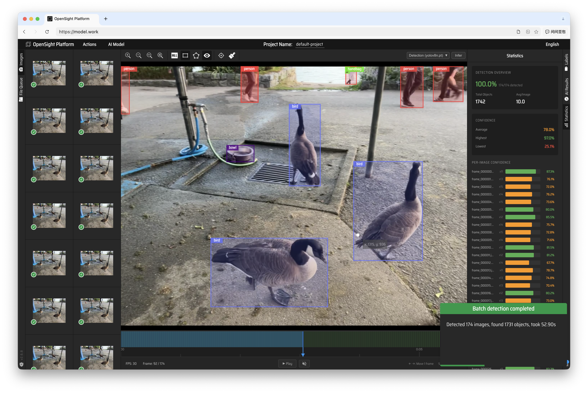

# OpenSight

[中文](README.md) | **English**

An intelligent visual-data annotation and edge-compute control platform covering annotation, inference, datasets, training, retrieval, and node-resource management.



[Live Demo](https://model.work/) · [Issues](https://github.com/quest-X/model-work-frontend/issues) · [Releases](https://github.com/quest-X/model-work-frontend/releases)

## Repository Role

This repository contains the OpenSight web frontend and product interaction layer. AI inference, plugins, and edge-node execution are provided by these repositories:

| Repository | Responsibility |
|------------|----------------|
| [model-work-backend](https://github.com/quest-X/model-work-backend) | Inference, datasets, training, accounts, and extension hosting |
| [model-work-extension](https://github.com/quest-X/model-work-extension) | Retrieval, model inspection, cameras, compute groups, and other plugins |
| [model-work-node](https://github.com/quest-X/model-work-node) | LynX communication, scheduling, and task execution |
| [model-work-monitor](https://github.com/quest-X/model-work-monitor) | Backend operations and data-status console |

OpenSight continues to evolve from Skalski's [make-sense](https://github.com/SkalskiP/make-sense).

## Core Capabilities

| Capability | Description |
|------------|-------------|
| Image and Video Annotation | Image management, frame extraction, timeline navigation, and frame-level annotation |
| Intelligent Inference | YOLO-family and custom `.pt` / `.onnx` models<br>Detection, batch detection, and OCR |
| Segmentation and Tracking | SAM, SAM 2, SAM 3, MobileSAM, FastSAM, and YOLO-seg<br>Cross-frame propagation |
| Data and Training | Dataset management, batch inference, and training jobs |
| Retrieval and Model Inspection | Similar-image search, model-stage heatmaps, and target attribution |
| Control Center | Compute groups, nodes, resources, cameras, and governed tasks |
| Annotation Exchange | Import: COCO, YOLO, VOC, LabelMe, VGG<br>Export: YOLO, COCO, VOC, CSV, LabelMe, VGG, JSON |

## Quick Start

```bash
git clone https://github.com/quest-X/model-work-frontend.git
cd model-work-frontend
npm install
npm start
```

Open `http://localhost:3001`. Full inference and control features also require sibling Backend and Extension checkouts to be running.

## Configuration

The development proxy targets `https://127.0.0.1:58600` by default. To use another backend, set this in `.env.local`:

```env
VITE_OPENSIGHT_BACKEND_TARGET=https://127.0.0.1:58600
```

## Development and Verification

```bash
npm start          # Development server
npm run build      # Production build
npm test           # Jest tests
npm run lint       # TypeScript checks
```

The main source tree is under `src/`: `views/` contains the UI, `services/` connects backend and extension APIs, `store/` owns Redux state, and `logic/` plus `workers/` provide business logic and background tasks.

## Current Boundaries

| Area | Boundary |
|------|----------|
| Models and runtime | This repository does not contain model weights, training data, or the Python inference environment |
| Browser project state | Becomes available to the Backend, Monitor, and Node only after export or upload |
| Extensions | Availability depends on Backend installation and runtime switches |

## License

This project is licensed under [GPL-3.0](LICENSE), following the upstream [make-sense](https://github.com/SkalskiP/make-sense) license.
